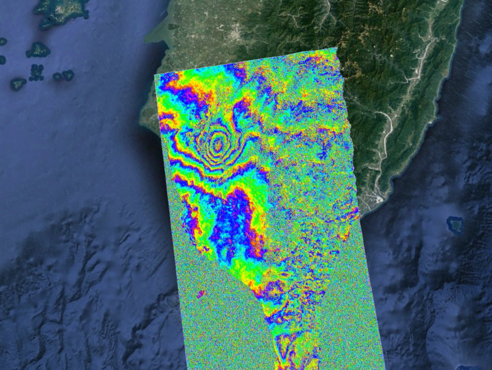
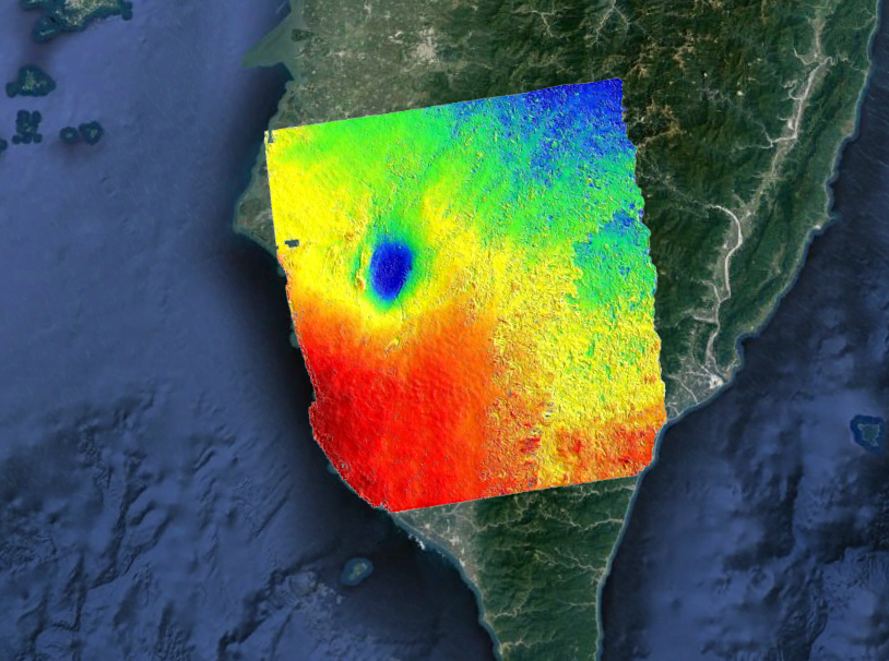

# GMTSAR Project

## Team: OK
## Members: Elena Osorio Tai, Qingkai Kong  

---   

## Project 1: Sentinel-1A data processing with GMTSAR
#### Event:
  

#### Results:

---

## Project 2: ALOS 1 data processing with GMTSAR  
#### Event:

#### Results

**DEM:** 

**Unwraped:**

---
## **Acknowledgement**  
Thank:  
[UNAVCO](http://www.unavco.org/) for providing the financial support.  
[GMTSAR developer team](http://topex.ucsd.edu/gmtsar/) for the great workshop.  
[GMT team](https://www.soest.hawaii.edu/gmt/) for great support!  

